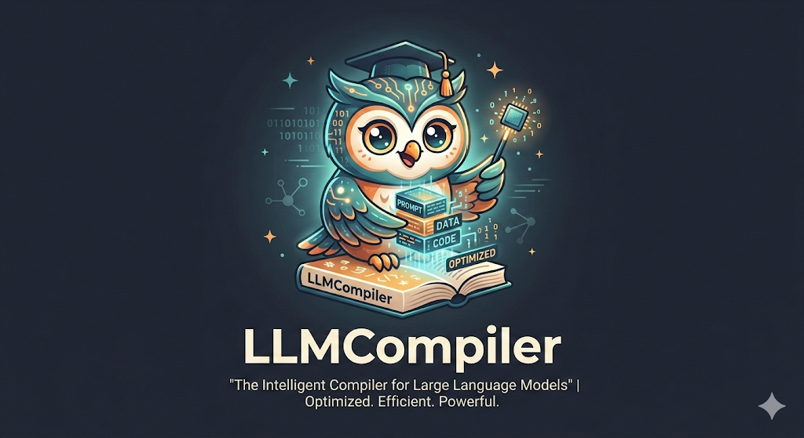
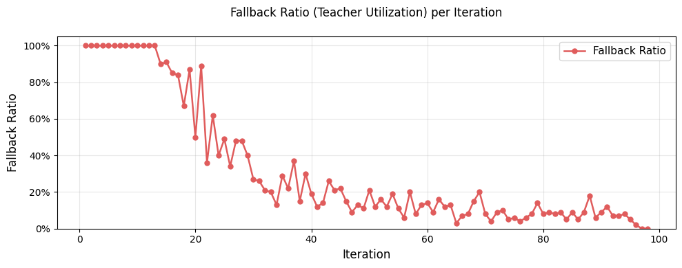
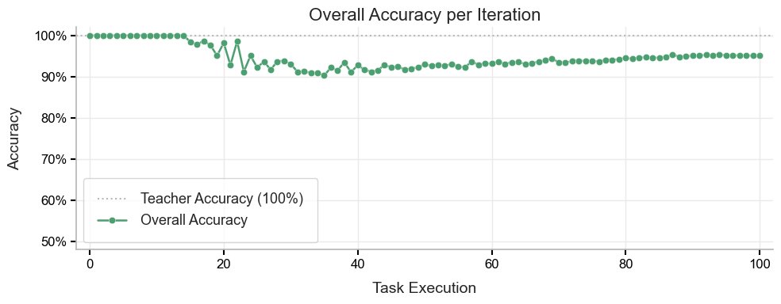

<p align="center">
  
</p>

# LLMCompiler：大语言模型的智能编译器

**优化 · 高效 · 强大**

[](https://github.com/zhaoliangvaio/llmcompiler)
[](https://arxiv.org/abs/2602.03006)
[](LICENSE)
[](https://www.python.org/)
[](https://pypi.org/project/llmcompiler/)
[](https://pypi.org/project/llmcompiler/)

[](README-zh.md)
[](README.md)

---

LLMCompiler 是一个用于**选择性调用 LLM** 并将**重复工作负载蒸馏**到更小学生模型的框架。仅在需要时使用教师 LLM——随着学生模型学习，LLM 调用次数趋近于零，同时保持准确率。


## 核心特性

| 🎯 **正确性感知回退** | 📚 **在线蒸馏** | 🔄 **回放缓冲训练** |
|----------------------|----------------|---------------------|
| 仅当学生模型不确定（低于置信度阈值）时使用教师 LLM | 在回退样本上根据教师标签持续更新学生模型 | 存储回退的 (文本, 标签) 对，定期重训学生模型和正确性预测器 |

---

## 安装

**从源码安装**（推荐用于开发）

```bash
git clone https://github.com/emory-llmcompiler/llmcompiler.git
cd llmcompiler
pip install -e .
```

**从 PyPI 安装**（发布后可用）

```bash
pip install llmcompiler
```

### 依赖要求

- Python >= 3.8
- PyTorch >= 1.9.0
- Transformers >= 4.20.0

可选（用于内置 OpenAI 教师和示例）：

- `openai>=1.0.0`
- `python-dotenv>=1.0.0`
- `pydantic>=2.0.0`

使用内置 OpenAI 教师时，请设置 API 密钥：

```bash
export OPENAI_API_KEY="your-key-here"
```

或在项目根目录的 `.env` 文件中添加 `OPENAI_API_KEY=your-key-here`（若已安装 `python-dotenv` 会自动加载）。

### 验证安装

```python
from llmcompiler import monitor
print("LLMCompiler 安装成功！")
```

或运行安装检查脚本：

```bash
python test_installation.py
```

---

## 快速开始

```python
from llmcompiler.monitor import monitor, wait_for_pending_training

# 定义任务和类别
task_id2classes = {"topic": ["World", "Sports", "Business", "Sci/Tech"]}

# 单条文本
results, fallback = monitor(
    task_id2classes,
    "Your input text here",
    mode="online",  # 或 "offline"
    p_threshold=0.8,
)

print(results)   # {"topic": "World"}
print(fallback)  # True 表示使用了 LLM，False 表示学生模型预测

# 使用 online 模式时，退出前等待后台训练完成
wait_for_pending_training()
```

完整 AG-News 示例（含 GCP 分类器和概念级标签）请参见 **[examples/example.py](examples/example.py)**。

---

## 工作原理

1. **学生预测** — 使用小模型对输入进行分类。
2. **置信度** — 估计预测的可靠性。
3. **回退** — 若置信度 ≥ `p_threshold`，返回学生输出；否则调用教师 LLM。
4. **在线学习** — 将 (文本, 教师标签) 存入回放缓冲，定期重训学生模型和正确性预测器。对于 GCP，可选子模块重训以优化选定的概念节点。

---

## 实验结果

### 回退机制



随着学生模型能力提升，回退比例（教师/LLM 使用率）随迭代逐渐下降。初期系统依赖教师保证正确性；随着在线蒸馏推进，学生模型处理更多查询，约在第 100 次迭代时 LLM 调用趋近于零。

### 准确率



训练过程中系统准确率始终接近教师基线（100%）。尽管 LLM 回退比例下降，准确率在初始阶段后稳定在约 95%，表明蒸馏后的学生模型在保持质量的同时降低了推理成本。

---

## 项目结构

```
llmcompiler/
├── src/
│   └── llmcompiler/
│       __init__.py       # 导出 monitor
│       buffers.py       # 回放缓冲（RingBuffer、平衡采样）
│       correctness.py   # 正确性预测器
│       defaults.py      # 编码器、分词器、优化器默认配置
│       models.py        # 分类头（DeepMLP、GCP）
│       monitor.py       # 核心 monitor() API 及训练编排
│       registry.py      # 按任务注册
│       selector.py      # 主动学习 / 离线样本选择
│       task.py          # 任务抽象
│       trainer.py       # 训练及 GCP 子模块重训
├── examples/
│   example.py           # AG-News + GCP 分类器（概念 DAG、在线/离线）
├── test_installation.py # 安装检查
├── setup.py
├── pyproject.toml
├── requirements.txt
├── README.md
└── LICENSE
```

---

## API 参考

### `monitor(...)` — 主要参数

#### 必需参数

- **`task_id2classes`** (`dict[str, list[str]]`): 任务 ID → 允许的类别标签列表。
  ```python
  {"task1": ["class1", "class2"], "task2": ["A", "B", "C"]}
  ```
- **`text`** (`str | list[str] | tuple[str, ...]`): 输入文本。单条字符串为单样本，列表/元组为批量。
- **`mode`** (str): **必需。** `"online"` 或 `"offline"`。
  - `"online"`: 推理过程中更新学生模型。
  - `"offline"`: 学生模型冻结；通过 `offline_select_method` 和 `offline_select_budget` 预先选择样本。

#### 可选参数

| 参数 | 默认值 | 说明 |
|------|--------|------|
| `llm_fn` | 内置 OpenAI | 教师函数。自定义签名：`llm_fn(texts, task_id2classes, **kwargs)`。 |
| `p_threshold` | `0.8` | 信任学生模型的最小置信度；低于此值则调用 LLM。 |
| `classifier_type` | `"deep_mlp"` | 学生分类头：`"deep_mlp"` 或 `"gcp"`。 |
| `classifier_kwargs` | `None` | 架构相关 kwargs（见下文）。 |
| `encoder` | `distilbert-base-uncased` | 编码器模型实例。 |
| `device` | auto | 设备（如 `"cuda:0"`、`"cpu"`）。 |
| `llm_kwargs` | `{}` | 传给 `llm_fn`。默认 OpenAI 教师可包含 `concept_info` 用于 GCP 概念标签。 |

#### 仅离线模式参数

| 参数 | 说明 |
|------|------|
| `offline_select_method` | `mode="offline"` 时**必需**。策略（如 `"random"`、`"uncertainty"`）。 |
| `offline_select_budget` | `mode="offline"` 时**必需**。发送给教师的最大样本数。 |

#### 返回值

二元组 `(results, fallback)`：

| 输入 | `results` | `fallback` |
|------|-----------|------------|
| 单个 `str` | `dict[str, str]` | `bool` |
| list/tuple str | `list[dict[str, str]]` | `list[bool]` |

### `wait_for_pending_training()`

使用 `mode="online"` 时，训练在后台线程中运行。退出或评估学生模型前请调用：

```python
from llmcompiler.monitor import wait_for_pending_training
wait_for_pending_training()
```

---

## 引用

若在研究中使用本框架，请引用：

```bibtex
@article{yu2026distilling,
  title     = {Distilling {LLM} Reasoning into Graph of Concept Predictors},
  author    = {Ziyang Yu and Liang Zhao},
  journal   = {arXiv preprint arXiv:2602.03006},
  year      = {2026},
  url       = {https://arxiv.org/abs/2602.03006},
  doi       = {10.48550/arXiv.2602.03006},
}
```

---

## 致谢

本框架由 Emory University 赵亮教授团队开发。感谢合作者与学生的反馈。设计借鉴了在线学习、知识蒸馏及自适应推理方面的相关工作。
