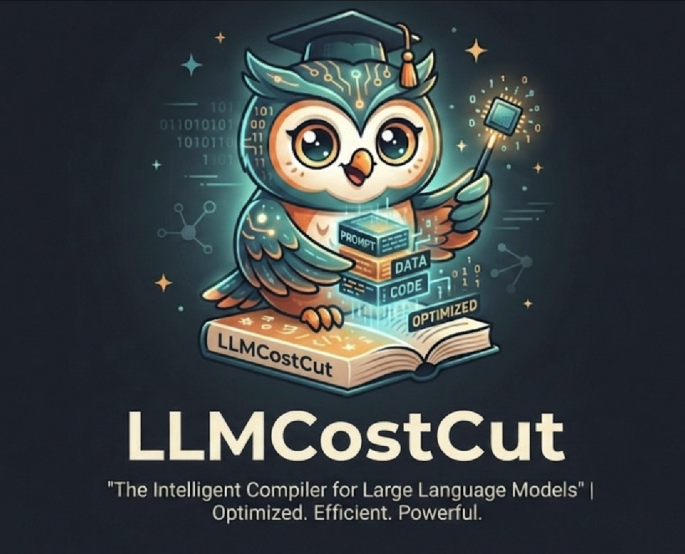
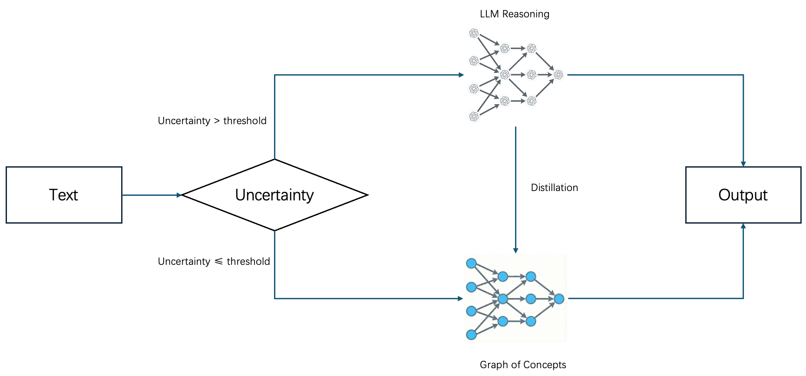
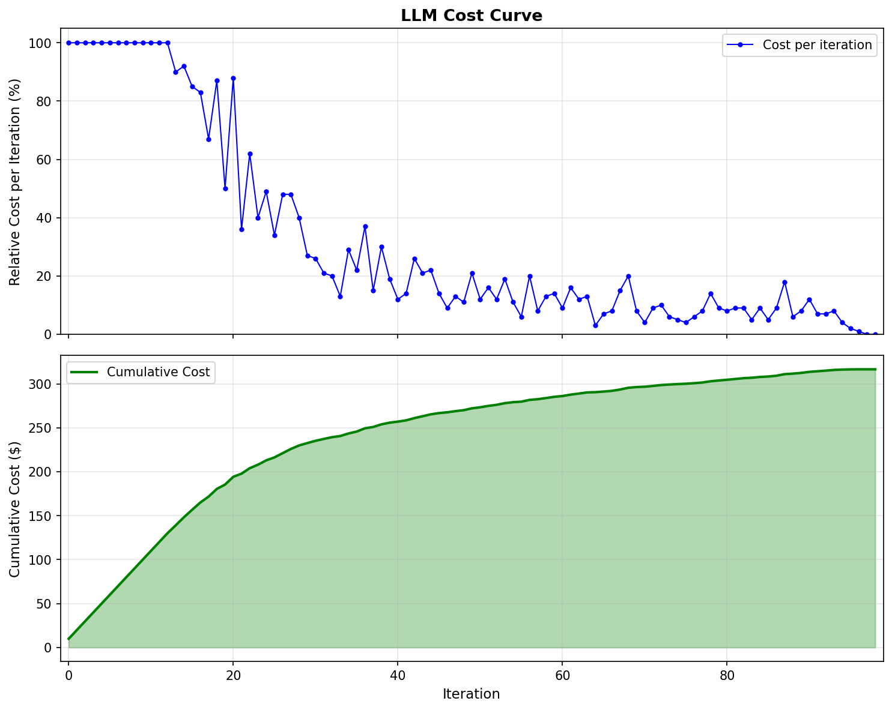
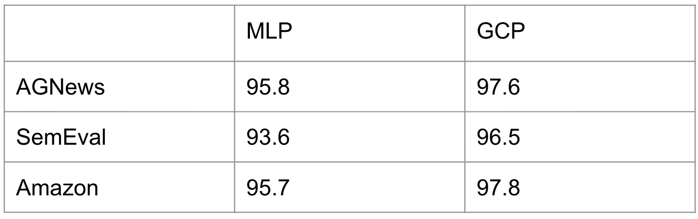

<p align="center">
  
</p>

# LLMCostCut: The Intelligent Cost Cutter for Large Language Models

**Optimized. Efficient. Powerful.**

[](https://github.com/zhaoliangvaio/llmcostcut)
[](https://arxiv.org/abs/2602.03006)
[](LICENSE)
[](https://www.python.org/)
[](https://pypi.org/project/llmcostcut/)
<!-- [](https://pypi.org/project/llmcostcut/) -->

[](README-zh.md)
[](README.md)

---

As LLM becomes more and more popular, the cost of using LLM is becoming a major concern. LLMCostCut is a discrimninative workload for LLM to reduce the cost of using LLM while maintaining the accuracy.


## Table of Contents

- 📋 [Applications](#applications)
- 🎯 [Key Features](#key-features)
- 📦 [Installation](#installation)
  - 📋 [Requirements](#requirements)
- 🚀 [Quick Start](#quick-start)
- ⚙️ [How It Works](#how-it-works)
- 📊 [Experimental Results](#experimental-results)
  - 📈 [Accuracy](#accuracy)
  - 💰 [Cost Reduction](#cost-reduction)
  - 📊 [Benchmarks Comparison](#benchmarks-comparison)
- 📁 [Project Structure](#project-structure)
- 📚 [API Reference](#api-reference)
  - 🔧 [monitor()](#monitor---main-parameters)
- 📐 [Graph of Concepts](#graph-of-concepts)
- 📖 [Citation](#citation)
- 🙏 [Acknowledgements](#acknowledgements)


## 📋 Applications

| ⚖️ **Legal** | 🏥 **Healthcare** | 💼 **Finance** |
|--------------|-------------------|----------------|
| - Case Outcome Prediction<br>- Contract Clause Classification | - Radiology Report Abnormality Classification<br>- Clinical Note Coding | - Sentiment Analysis<br>- Risk Assessment |


## 🎯 Key Features

| 📈 **Accuracy up to 95%** | 💰 **Around 10× Cost Reduction** | ⚡ **Nearly 1000× Speedup** | 🛠️ **Easy to Use** |
|---------------------------|---------------------------|----------------------|-------------------|
| Maintain near-teacher quality while cutting LLM calls toward zero | Student handles most queries; teacher only when uncertain — inference bills drop dramatically | Small student model (100k parameters) inference vs. LLM (1T parameters) API calls — orders of magnitude faster | Minimal code changes — Runnable in few lines of code |


---

## 📦 Installation

**Install from source** (recommended for development)

```bash
git clone https://github.com/emory-llmcostcut/llmcostcut.git
cd llmcostcut
pip install -e .
```

**Install from PyPI**

```bash
pip install llmcostcut
```

### 📋 Requirements

- Python >= 3.8
- PyTorch >= 1.9.0
- Transformers >= 4.20.0

Optional (for built-in OpenAI teacher and examples):

- `openai>=1.0.0`
- `python-dotenv>=1.0.0`
- `pydantic>=2.0.0`

When using the built-in OpenAI teacher, set your API key:

```bash
export OPENAI_API_KEY="your-key-here"
```

Or put `OPENAI_API_KEY=your-key-here` in a `.env` file in the project root (loaded automatically if `python-dotenv` is installed).


## 🚀 Quick Start

Instead of calling the LLM directly every time, use **`monitor`** as a smart router: it first tries the small student model; only when the student is uncertain (confidence below `p_threshold`) does it fall back to the teacher LLM. Over time, the student learns and LLM calls drop toward zero.

```python
"""
Simple LLMCompiler example: reduce LLM API call cost on AG-News.

LLMCompiler trains a small student (DistilBERT + MLP) on-the-fly.
It only calls the teacher LLM when the student is not confident enough.
As the student learns, LLM call rate drops — cutting API cost.

Usage:
export OPENAI_API_KEY=sk-...
python examples/simple_cost_reduction.py
"""

import random
from datasets import load_dataset
from llmcompiler.monitor import monitor, wait_for_pending_training

# --- Benchmark: AG-News (4-class topic classification) ---
ds = load_dataset("ag_news", split="train[:500]") # 500 samples for quick demo
LABEL_MAP = {0: "World", 1: "Sports", 2: "Business", 3: "Sci/Tech"}
samples = [(row["text"], LABEL_MAP[row["label"]]) for row in ds]
random.shuffle(samples)

TASK = {"topic": ["World", "Sports", "Business", "Sci/Tech"]}

# --- Optional: plug in your own LLM function (e.g. Claude, GPT-4) ---
# Signature: llm_fn(texts, task_id2classes) -> list[dict[task_id, label]]
# Leave llm_fn=None to use the built-in OpenAI teacher (reads OPENAI_API_KEY).
def my_llm_fn(texts, task_id2classes, **kwargs):
  import openai
  client = openai.OpenAI()
  results = []
  for text in texts:
  classes = task_id2classes["topic"]
  resp = client.chat.completions.create(
    model="gpt-4o-mini",
    messages=[{
    "role": "user",
    "content": f"Classify the news into one of {classes}.\nText: {text[:300]}\nReply with only the label."
    }],
    max_tokens=10,
  )
  label = resp.choices[0].message.content.strip()
  label = label if label in classes else classes[0] # fallback
  results.append({"topic": label})
  return results

# --- Stream samples through monitor(); watch LLM call rate drop ---
llm_calls, correct, total = 0, 0, len(samples)

for i, (text, true_label) in enumerate(samples):
  pred, used_llm = monitor(TASK, text, llm_fn=my_llm_fn, mode="online")

if used_llm:
  llm_calls += 1
if pred.get("topic") == true_label:
  correct += 1

# Print progress every 100 samples
if (i + 1) % 100 == 0:
  print(f"[{i+1:>4}/{total}] LLM-rate: {llm_calls/(i+1)*100:.1f}% "
  f"Accuracy: {correct/(i+1)*100:.1f}%")

monitor.close()
print(f"\nFinal — total LLM calls: {llm_calls}/{total} ({llm_calls/total*100:.1f}%)")
print(f"Final — accuracy: {correct}/{total} ({correct/total*100:.1f}%)")
```

See **[examples/example.py](examples/example.py)** for a full AG-News demo with GCP classifier and concept-level labels.

---

## ⚙️ How It Works



---

## 📊 Experimental Results

### 💰 Cost Reduction



The inference cost decreases over time as the student model handles more queries and the fallback to the teacher LLM becomes less frequent.

### 📈 Accuracy


System accuracy stays close to the teacher baseline (100%) during training. Despite the drop in LLM fallback, accuracy stabilizes around 95% after the initial phase, showing that the distilled student preserves quality while cutting inference cost.

### 📊 Benchmarks Comparison



Across AGNews, SemEval, and Amazon, our distilled student models **approximately comparable to the teacher LLM baseline**: GCP reaches 97.6%, 96.5%, and 97.8% respectively, while MLP achieves 95.8%, 93.6%, and 95.7%. This demonstrates that the framework preserves prediction quality  while enabling efficient inference.


---

## 📁 Project Structure

```
llmcostcut/
├── src/
│   └── llmcostcut/
│       __init__.py       # Exports monitor
│       buffers.py       # Replay buffer (RingBuffer, balanced sampling)
│       correctness.py   # Correctness predictor
│       defaults.py      # Encoder, tokenizer, optimizer defaults
│       models.py        # Classifier heads (DeepMLP, GCP)
│       monitor.py       # Core monitor() API and training orchestration
│       registry.py      # Per-task registry
│       selector.py      # Active-learning / offline sample selection
│       task.py          # Task abstraction
│       trainer.py       # Training and GCP submodule retraining
├── examples/
│   example.py           # AG-News with GCP classifier (concept DAG + online/offline)
├── setup.py
├── pyproject.toml
├── requirements.txt
├── README.md
└── LICENSE
```

---

## 📚 API Reference

### 🔧 `monitor(...)` — main parameters

#### Required

- **`task_id2classes`** (`dict[str, list[str]]`): Task ID → list of allowed class labels.
  ```python
  {"task1": ["class1", "class2"], "task2": ["A", "B", "C"]}
  ```
- **`text`** (`str | list[str] | tuple[str, ...]`): Input text(s). Single string for one sample, list/tuple for batch.
- **`mode`** (str): **Required.** `"online"` or `"offline"`.
  - `"online"`: student is updated during inference.
  - `"offline"`: student is frozen; samples are selected up-front via `offline_select_method` and `offline_select_budget`.

#### Optional parameters

| Parameter | Default | Description |
|-----------|---------|-------------|
| `llm_fn` | built-in OpenAI | Teacher function. Custom signature: `llm_fn(texts, task_id2classes, **kwargs)`. |
| `p_threshold` | `0.8` | Min confidence to trust the student; below this, use LLM. |
| `classifier_type` | `"deep_mlp"` | Student head: `"deep_mlp"` or `"gcp"`. |
| `classifier_kwargs` | `None` | Architecture-specific kwargs (see below). |
| `encoder` | `distilbert-base-uncased` | Encoder model instance. |
| `device` | auto | Device (e.g. `"cuda:0"`, `"cpu"`). |
| `llm_kwargs` | `{}` | Passed to `llm_fn`. For default OpenAI teacher, can include `concept_info` for GCP concept labels. |

#### Offline-only parameters

| Parameter | Description |
|-----------|-------------|
| `offline_select_method` | **Required** when `mode="offline"`. Strategy (e.g. `"random"`, `"uncertainty"`). |
| `offline_select_budget` | **Required** when `mode="offline"`. Max number of samples to send to the teacher. |

#### Return value

A 2-tuple `(results, fallback)`:

| Input | `results` | `fallback` |
|-------|------------|------------|
| Single `str` | `dict[str, str]` | `bool` |
| list/tuple str | `list[dict[str, str]]` | `list[bool]` |

<!-- ### ⏳ `monitor.close()` / `monitor.start()`

When using `mode="online"`, training runs in a background thread. Before exit or before evaluating the student, either call `monitor.close()` explicitly or use the context manager:

```python
from llmcostcut.monitor import monitor

# Explicit close
monitor.close()

# Or use context manager (auto-closes on exit)
with monitor.start():
    results, fallback = monitor(task_id2classes, text, mode="online")
``` -->

---


## 📖 Citation

If you use this framework in your research, please cite:

```bibtex
@article{yu2026distilling,
  title     = {Distilling {LLM} Reasoning into Graph of Concept Predictors},
  author    = {Ziyang Yu and Liang Zhao},
  journal   = {arXiv preprint arXiv:2602.03006},
  year      = {2026},
  url       = {https://arxiv.org/abs/2602.03006},
  doi       = {10.48550/arXiv.2602.03006},
}
```

---

## 🙏 Acknowledgements

This framework was developed by the team led by Prof. Liang Zhao at Emory University. We thank collaborators and students for feedback. The design draws on work in online learning, knowledge distillation, and adaptive inference.
